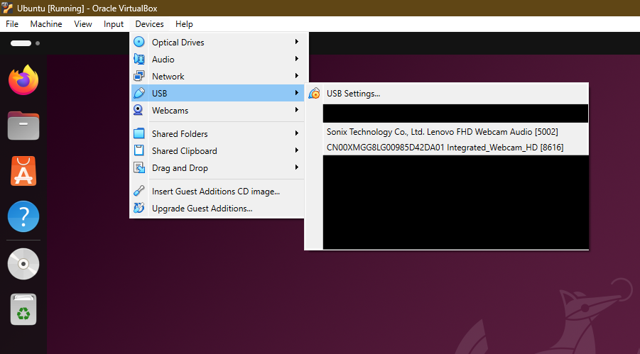
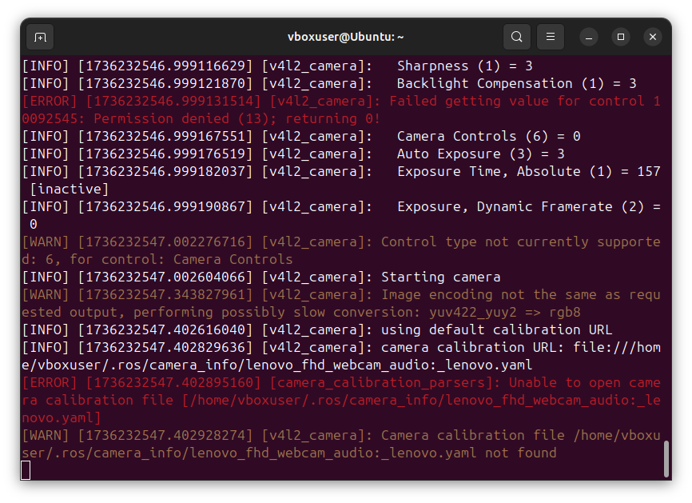
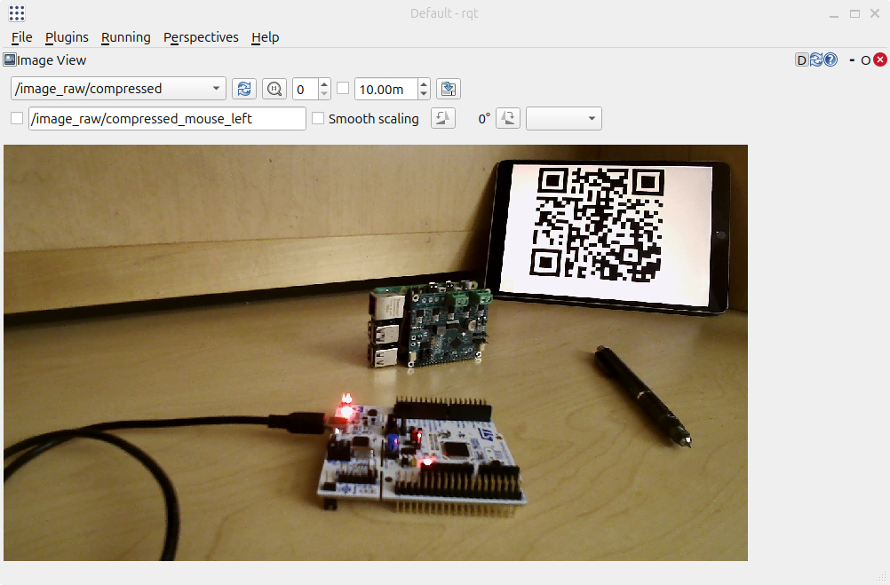
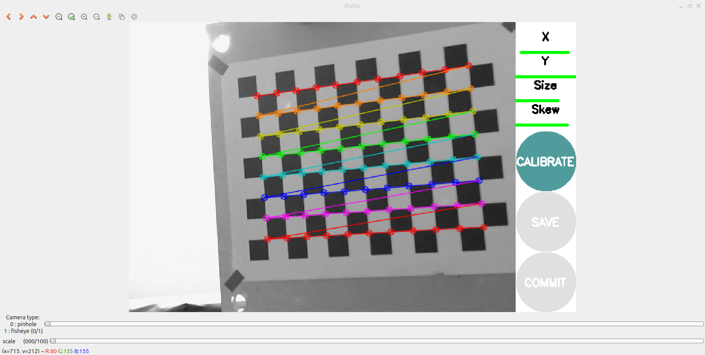
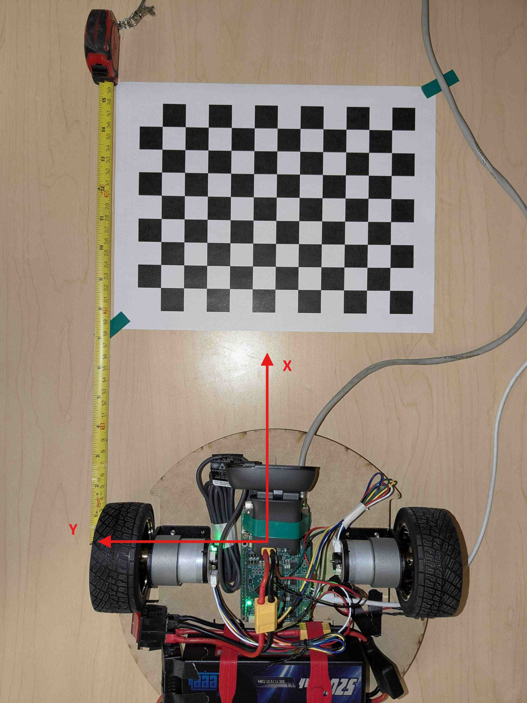
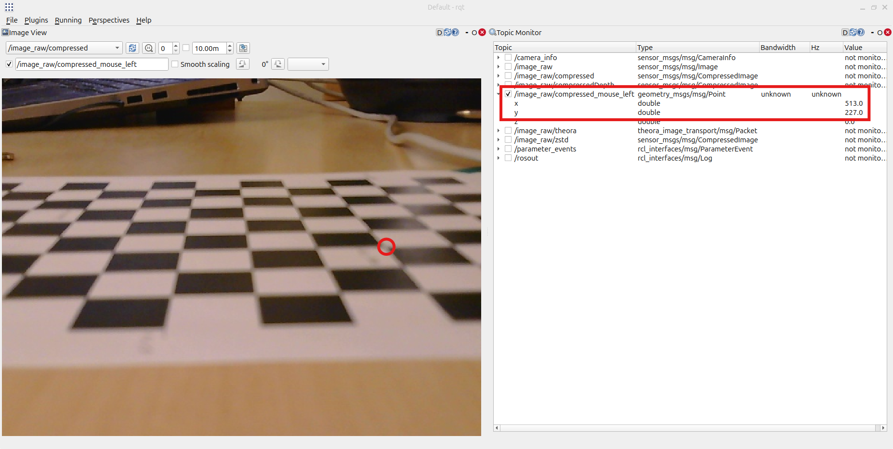
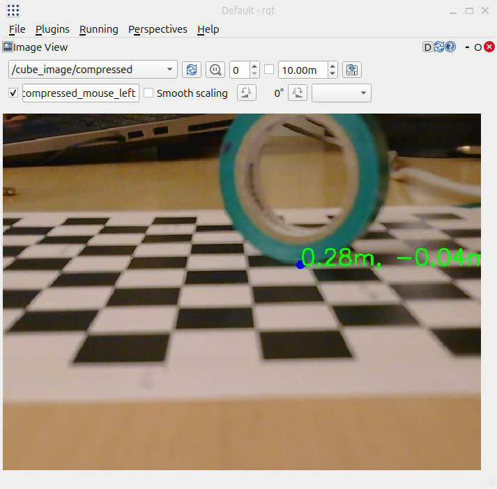

# Camera how-to
Guide for using a camera with ROS2.

## Prerequisite
1. [ROS2 installation](https://github.com/MASLAB/ros2-setup)
2. Access to a webcam (either laptop's webcam, or preferably the provided USB webcam)

## Connection to VirtualBox
To connect webcam in Virtualbox, select `Devices > USB`. You will get to select either your laptop integrated webcam, the provided webcam, or any other webcam you have attached to your computer. **DO NOT** use `Devices > Webcams`.

<p align="center">

</p>

## Test webcam
You can test your webcam by installing `Cheese`, a camera application similiar to Apple's `Photobooth` or Windows's `Camera`. It is available in the Ubuntu App Center.

# ROS2 Image Processing
## Image publishing
Webcam video feed can be published as ROS2 [`Image`](https://docs.ros.org/en/jazzy/p/sensor_msgs/interfaces/msg/Image.html) message. This message is available as part of the standard (preinstalled) `sensor_msgs` package. 

Multiple nodes can subscribe to the webcam images and perform their own's image processing and publish their result. Example use case: a node that recognizes the wall and publish a distance to the wall, a node that recognizes the cubes and publish the locations of the cubes with their associated color.

To use camera in ROS2, let's use the ROS2 package `v4l2_camera`. More information on how to customize `v4l2_camera` can be found on the documentation site at: https://docs.ros.org/en/jazzy/p/v4l2_camera/index.html.

For now, let's start with the basics.

### `v4l2_camera` Installation
To install `v4l2_camera`, install the `ros-jazzy-v4l2-camera` package with:

```shell
sudo apt install ros-jazzy-v4l2-camera
```

To get images more quickly, we will also need `image-transport-plugins` to enable compression. Install it with:

```shell
sudo apt install ros-jazzy-image-transport-plugins
```

### Start publishing image
To start publishing images with `v4l2_camera`, run its camera node:

```shell
ros2 run v4l2_camera v4l2_camera_node
```

This command spins up a camera publishing node and publish camera images from camera. We can provide other parameters to control the camera. For example, we can set the image size to 1280 x 720 with `image_size` parameter:

```shell
ros2 run v4l2_camera v4l2_camera_node --ros-args -p image_size:=[1280,720]
```

For more parameters, see: https://docs.ros.org/en/jazzy/p/v4l2_camera/index.html#parameters

> [!TIP]
> In general, you can pass in parameters to a ROS2 node like this:
> ```shell
> ros2 run package_name executable_name --ros-args -p param1_name:=param1_value -p param2_name:=param2_value
> ```

> [!IMPORTANT]
> If your camera seems to run very slowly, it is likely due to automatic light balance. Disable it with `white_balance_automatic:=False`.

If `v4l2_camera_node` runs successfully, you will see something like this:

<p align="center">

</p>

> [!NOTE]
> There are some errors on here, some are typical because cameras may not supports all the controls and encodings that `v4l2_camera` uses. One is particularly interesting and can be fixed; it is the `[camera_calibration_parsers]` error. This happens because we have not calibrated the camera yet. We will do them when we work on video homography. For now, we can ignore these errors.

### Visualizing image
To see the images published, open `rqt` like in the [FizzBuzz](https://github.com/MASLAB/ROS2_FizzBuzz?tab=readme-ov-file#rqt) tutorial.

This time, instead of looking at the node graph, let's look at images with `Plugins > Visualization > Image View`. Select the `/image_raw/compressed` topic with the drop down menu on top left corner to view the compressed images.

<p align="center">

</p>

> [!NOTE]
> Image view with RQT on virtual machine may crash from time to time, especially when trying to view uncompressed image. Therefore, make sure to view the compressed images instead of the raw ones.

## Image processing
We will use OpenCV (Open Computer Vision) for processing the images. Let's install OpenCV and make a node to subscribe to and process the images.

Before using OpenCV with ROS2, it will be helpful to checkout some examples here: https://github.com/MASLAB/cv-samples. This is from MASLAB 2020 but the code is still functional for `color_segmentation`. We will use it for detecting cubes later. For more OpenCV tutorials, check out https://www.geeksforgeeks.org/opencv-python-tutorial/

### Installation
To get OpenCV, install `python3-opencv` using `sudo apt install ...` as we have been using for other packages.

To convert ROS2 images to OpenCV, also install `ros-jazzy-cv-bridge`.

### ROS2 image processing package
#### Create package
Let's create a new ROS2 package in a ROS2 workspace. You may also create a new workspace or use the same one as FizzBuzz.

Navigate to your workspace with `cd ~/ros2_ws` or wherever you have your workspace. Create a new `image_processing` package:

```shell
cd ./src
ros2 pkg create --build-type ament_python image_processing
```

Edit `package.xml` to make it depends on `rclpy`, `std_msgs` (for publishing cube coordinate), `sensor_msgs` (for `Image` message), `cv_bridge` and `cv2` (for OpenCV).

#### Cube detecting node
Let's create a node that subscribes to the images and find cubes.

Make a node named `cube_detect` with `cube_detect_node.py` in `src/image_processing/image_processing/` (similar to FizzBuzz). 

For this node, do the following:
1. Import `CompressedImage` from `sensor_msgs.msg`
1. Import `cv2`
1. Import `CvBridge` from `cv_bridge`
1. Import `numpy` as `np`
1. Create a callback for processing an image called `image_callback` with:
    ```Python
    def image_callback(self, msg: CompressedImage):
    ```
1. In `__init__`:
    1. Initialize a new `CvBridge` with `self.bridge = CvBridge()`
    1. Make a subscriber `image_sub` that subscribes to `image_raw/compressed` topic with `CompressedImage` type and `image_callback` callback function
    1. Make a publisher `cube_image_pub` that publishes to `cube_image/compressed` topic with `CompressedImage` type
1. In `image_callback`:
    1. Convert the message to a CV2 image frame with `frame = self.bridge.compressed_imgmsg_to_cv2(msg, "bgr8")`. (the `bgr8` argument converts the image to BGR format to be used later)
    1. Apply the same image processing technique as in https://github.com/MASLAB/opencv-example/blob/master/object_detection.py to find the contours of a green cube. You may want to tune your HSV thresholds for best results
    1. Instead of showing the image with `cv2.imshow`, publish the debugging image with
        ```Python
        cube_image_msg = self.bridge.cv2_to_compressed_imgmsg(frame)
        self.cube_image_pub.publish(cube_image_msg)
        ```

Add the node to `setup.py`

> [!TIP]
> Refer to [FizzBuzz subscriber node](https://github.com/MASLAB/ROS2_FizzBuzz?tab=readme-ov-file#fizzbuzz-node) for example of how to do these actions. Fully implemented `image_processing` package is also available for reference.

## Cube detection test
Now that we have the image published and processed, run both `v4l2_camera_node` and `cube_detect_node`. Check `rqt` image view for the debugging image.

> [!TIP]
> The camera may automatically change brightness. This is okay for Zoom calls, but it may mess up our HSV image segmentation. Disable it by setting `auto_exposure` to `1` (manual exposure).

## Launch files
We can also make a launch file like [FizzBuzz launch](https://github.com/MASLAB/ROS2_FizzBuzz?tab=readme-ov-file#making-a-launch-file).

1. `Setup `package.xml`, `setup.py`, and add folder for launch
1. Create the launch file
1. Add the `cube_detector` node to launch file
1. Add `v4l2_camera` node with:
    ```Python
    v4l2_camera_node = Node(
        package='v4l2_camera',
        executable='v4l2_camera_node',
        parameters=[
            {"image_size": [640,480]},
        ]
    )
    ```
1. Add parameters as necessary

Stop all currently running nodes then build and run the launch file. Open `rqt` and check that we still have cube detection.

## Set up on Raspberry Pi 5 (NEED ETHERNET)

> [!IMPORTANT]
> Due to a bug in the Pi's setup script, images from the Pi may not be sent to your computer. Check how to fix on [Kitbot how to](https://github.com/MASLAB/kitbot-how-to?tab=readme-ov-file#fix-a-setup-bug) or come by staff desk during lab hours.

To test it out on the Pi, connect to it via Ethernet. Once connected:

### Simple test
#### On Pi (through SSH or VSCode Remote):
1. Connect a webcam to a Pi's USB port
1. Install the necessary packages (`v4l2_camera`, OpenCV, etc)
1. Run the `v4l2_camera_node` on the Pi 

#### On personal computer
1. See that you get images with `rqt` on your computer

### Add image processing
#### On personal computer
1. If you have not already, clone your team's workspace's github repository at `git@github.mit.edu:maslab-2025/team-XX.git` to your computer (replace `XX` with your team number). This repository is already set up on your team's Raspberry Pi as workspace `ros_ws`. 
1. Create a new branch to experiment with
1. Add your `image_processing` code to that branch
1. Publish the branch

#### On Pi
1. Checkout the experimental branch
1. Pull the changes
1. Build the `image_processing` package and `source` the overlay
1. Launch the package

#### Return to personal computer
1. Run `rqt` and check for the processed image, now from the Pi.

# Advanced camera usage
Cube detect is cool, but it only draw boxes around cubes for now. We can do more with the camera! Read on for more advanced camera usage.

## Camera calibration
To use the camera to its full potential, we need to properly calibrate the camera. 

### Getting calibration file
> [!TIP]
> We have already performed calibration on the kit's camera (Logitech Brio 101) using the default resolution of 640x480. You can download the calibration file here: [brio_101.yaml](file/brio_101.yaml)

If you want to use other parameters / other camera / know how to do calibration, follow this guide to get the calibration file. The full camera calibration guide can be found at: https://docs.ros.org/en/ros2_packages/jazzy/api/camera_calibration/doc/tutorial_mono.html

> [!IMPORTANT]
> Camera calibration should be done on your computer since it uses a GUI to help with calibration. The calibration file can be copied over to the Pi afterward.

#### Install camera calibration package
To calibrate the camera, we will use `camera_calibration` package. Install `ros-jazzy-camera-calibration` using `sudo apt install ...` like before.

#### Calibration pattern
We will also need a calibration pattern of checkered squares. We have one at staff desk with 2 cm x 2 cm squares. You can also print them out using this file: [calibration.pdf](file/calibration.pdf). Make sure to apply no scaling to get the correct square size. Once you have a pattern, make sure to tape it down on a surface as flat as possible.

#### Running calibration
To run the calibration procedure, run `v4l2_camera_node` in a terminal with all the parameters you intended to use for the robot (no white balance, manual brightness, etc.). 

In another terminal, run the calibration node with:
```shell
ros2 run camera_calibration cameracalibrator --size 11x8 --square 0.02 --no-service-check --ros-args --remap image:=/image_raw
```

After running the calibrator, a calibration window will pop up. Move, tilt, and rotate the calibration pattern around until `X`, `Y`, `Size`, and `Skew` parameters are all green 🟩.

<p align="center">

</p>

Once all the parameters are green, click the `CALIBRATE` button and wait a few seconds for `SAVE` and `COMMIT` buttons to become available.

Click the `SAVE` button and close the camera calibration node's terminal (closing the calibration window does not work).

The calibration data is now saved in `/tmp/calibrationdata.tar.gz`. Copy it to your home folder with:
```shell
cp /tmp/calibrationdata.tar.gz ~/
```

Extract the calibration data by opening the `calibrationdata.tar.gz` file in your home folder. The calibration data contains all the images for the calibration and the actual calibration file `ost.yaml`.

<p align="center">

</p>

Open the calibration file to examine some contents. It contains all the parameters necessary to correct camera distortions. The calibrator will set the `camera_name` parameter to a generic `narrow_stereo` name. Let's change it to `brio_101` like the kit's camera. Otherwise, `v4l2_camera` will warn but still going to apply the calibration. We should rename the calibration file from `ost.yaml` to `brio_101.yaml` to know that it is the calibration file for a Logitech Brio 101 as well.

```yaml
image_width: 640
image_height: 480
camera_name: brio_101 # From narrow_stereo
camera_matrix:
  rows: 3
  cols: 3
  data: [888.54513,   0.     , 349.44456,
           0.     , 890.80918, 241.37833,
           0.     ,   0.     ,   1.     ]
distortion_model: plumb_bob
... (more below) ...
```

### Using calibration file
#### ROS2 run
To use the calibration file, we can run `v4l2_camera_node` and provide the calibration file with:

```shell
ros2 run v4l2_camera v4l2_camera_node --ros-args -p camera_info_url:=file://<where your calibration file is saved>
```

#### ROS2 launch
We can also provide configuration file when calling `v4l2_camera_node` in launch file.

First let's add the `brio_101.yaml` calibration file to the `image_processing` package or whichever package that is launching `v4l2_camera_node`. Let's add it to a `config` folder. Your package directory should now have a `config` folder with `brio_101.yaml` calibration file inside similar to this structure:

```shell
$ tree ~/ros2_ws/src/image_processing
.
├── config
│   └── brio_101.yaml
├── image_processing
│   ├── cube_detect_node.py
│   └── __init__.py
├── launch
│   └── cube_detect_launch.py
├── package.xml
├── resource
│   └── image_processing
├── setup.cfg
├── setup.py
└── test
    ├── test_copyright.py
    ├── test_flake8.py
    └── test_pep257.py

6 directories, 11 files

```

Like our `launch` folder, we will also need to add `config` folder to our package by adding it to `setup.py`'s `data_files`:

```Python
data_files=[
    ('share/ament_index/resource_index/packages',
        ['resource/' + package_name]),
    ('share/' + package_name, ['package.xml']),
    # Include all launch files.
    (os.path.join('share', package_name, 'launch'), glob(os.path.join('launch', '*launch.[pxy][yma]*'))),
    # Include all config files.
    (os.path.join('share', package_name, 'config'), glob(os.path.join('config', '*.[pxy][yma]*'))),
],
```

We can then refer to the configuration file in our launch file. First import `os` and `get_package_share_directory` into the launch file (i.e. `cube_detect_launch.py`) with:

```Python
import os
from ament_index_python.packages import get_package_share_directory
```

Then we can get the path to the calibration file and add it to `v4l2_camera_node`:

```Python
camera_cal_path = os.path.join(
    get_package_share_directory("image_processing"), "config", "brio_101.yaml"
)
v4l2_camera_node = Node(
    package="v4l2_camera",
    executable="v4l2_camera_node",
    parameters=[
        {
            "image_size": [640, 480],
            "camera_info_url": "file://" + camera_cal_path,
        },
    ],
)
```

## Camera Homography
As mentioned in class, we can use some transformation to figure out how far away is an object in the picture just from their pixel location. This technique is called [homography](https://en.wikipedia.org/wiki/Homography_%28computer_vision%29). With a well calibrated camera, we can figure out the transformation and get a good estimate of the location of the cube with respect to the robot.

### Data collection
To get the transformation, we need to collect some points (at least 3, as many as you want for higher accuracy). We will need both the Pi and the computer to get the data.

First, make sure that the camera is fixed to the robot and will not tilt around later because the data we will collect is specific to the camera location and orientation. Don't just tape it! ~~like your lazy MASLAB TA~~. Also make sure the camera is mounted somewhere high and tilted down to look at the floor.

Then place some grid pattern down to help with getting the location in the 3D world. By ROS convention, the robot's front aligns with X axis with Y axis to the left such that Z axis is up.

<p align="center">

</p>

Once you are ready to take measurements:

#### On Pi
1. [Run `v4l2_camera_node` with calibration file](#ros2-run)

#### On your computer
1. Run `rqt`
1. Open `Plugins > Visualization > Image View` and select `/image_raw/compressed` topic
1. Check the box next to `/image_raw/compressed_mouse_left`. This will allow RQT to publish the pixel of the clicked point.
1. Open `Plugins > Topics > Topics Monitor` and check `/image_raw/compressed_mouse_left` to monitor.
1. Pick a point in the real world and measure how far away the point is from the robot in x and y. Use meter.
1. Click the point in `Image View` and get `x,y` values in `Topics Monitor`.
1. Record the values and repeat as many as you like.

<p align="center">

</p>

### Homography calculation

#### Cube locate node
Now that we have the data, let's locate the cube! Let's make a cube locate node similar to the cube detect node. Let's call it `cube_locate` with `cube_locate_node.py` in `src/image_processing/image_processing`.

For this node, you can copy and paste your cube detect node and slightly modify it to calculate the actual distance from robot:

1. Add the points we collected from [data collection](#data-collection) as:
    ```Python
    # Example data from /image_raw/compressed_mouse_left
    PTS_IMAGE_PLANE = [[564, 375],
                       [447, 326],
                       [332, 289],
                       [237, 326],
                       [133, 357],
                       [266, 394]]

    # Example data from corresponding point in real world
    PTS_GROUND_PLANE = [[3, -5],
                        [6, -3],
                        [9,  0],
                        [6,  2],
                        [4,  4],
                        [2,  1]]
    ```
1. In `__init__`, calculate a homography matrix with:
    ```Python
    #Initialize data into a homography matrix
    np_pts_ground = np.array(PTS_GROUND_PLANE)
    np_pts_ground = np.float32(np_pts_ground[:, np.newaxis, :])

    np_pts_image = np.array(PTS_IMAGE_PLANE)
    np_pts_image = np.float32(np_pts_image[:, np.newaxis, :])

    self.h, err = cv2.findHomography(np_pts_image, np_pts_ground)
    ```
1. Add a helper function to the cube locator node class:
    ```Python
    def transformUvToXy(self, u, v):
        """
        u and v are pixel coordinates.
        The top left pixel is the origin, u axis increases to right, and v axis
        increases down.

        Returns a normal non-np 1x2 matrix of xy displacement vector from the
        camera to the point on the ground plane.
        Camera points along positive x axis and y axis increases to the left of
        the camera.

        Units are in meters.
        """
        homogeneous_point = np.array([[u], [v], [1]])
        xy = np.dot(self.h, homogeneous_point)
        scaling_factor = 1.0 / xy[2, 0]
        homogeneous_xy = xy * scaling_factor
        x = homogeneous_xy[0, 0]
        y = homogeneous_xy[1, 0]
        return x, y
    ```
1. In `image_callback` function:
    1. Calculate pixel of the center of the bottom of the cube.
    1. Use `transformUvToXy` to calculate the world coordinate of the bottom of the cube.
    1. Use `cv2.circle` to add the center bottom point to the image for debugging.
    1. Use `cv2.putText` to add text of the world coordinate to the image for debugging.

If everything go well then congratulations! You have calculated location of a cube from an image! If not, feel free to check the code for more references.

<p align="center">

</p>


